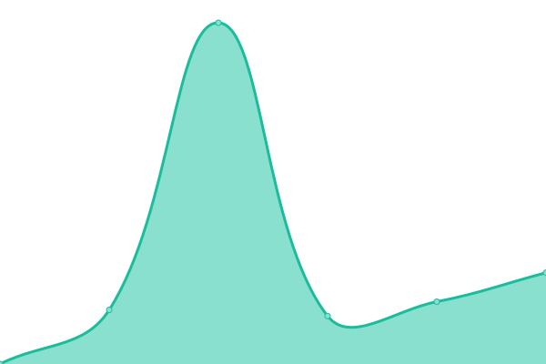

# [📈 Live Status](https://nexmoe.github.io/upptime): <!--live status--> **🟧 Partial outage**

This repository contains the open-source uptime monitor and status page for [Nexmoe](https://bonjour.bio/nexmoe), powered by [Upptime](https://github.com/upptime/upptime).

With [Upptime](https://upptime.js.org), you can get your own unlimited and free uptime monitor and status page, powered entirely by a GitHub repository. We use [Issues](https://github.com/nexmoe/upptime/issues) as incident reports, [Actions](https://github.com/nexmoe/upptime/actions) as uptime monitors, and [Pages](https://nexmoe.github.io/upptime) for the status page.

<!--start: status pages-->
<!-- This summary is generated by Upptime (https://github.com/upptime/upptime) -->
<!-- Do not edit this manually, your changes will be overwritten -->
<!-- prettier-ignore -->
| URL | Status | History | Response Time | Uptime |
| --- | ------ | ------- | ------------- | ------ |
|  [QWQ](https://qwq.aigpu.cn) | 🟩 Up | [qwq.yml](https://github.com/slmnb-lab/upptime/commits/HEAD/history/qwq.yml) | 

 1964ms
     
 | 

<a href="https://aigpulab.github.io/upptime/history/qwq">100.00%</a>
    

|  [API](https://api.suanli.cn) | 🟩 Up | [api.yml](https://github.com/slmnb-lab/upptime/commits/HEAD/history/api.yml) | 

 1248ms
     
 | 

<a href="https://aigpulab.github.io/upptime/history/api">100.00%</a>
    

|  [Chat](https://chat.aigpu.cn) | 🟥 Down | [chat.yml](https://github.com/slmnb-lab/upptime/commits/HEAD/history/chat.yml) | 

 2057ms
     
 | 

<a href="https://aigpulab.github.io/upptime/history/chat">0.00%</a>
    

|  [Flux](https://flux.comnergy.com) | 🟩 Up | [flux.yml](https://github.com/slmnb-lab/upptime/commits/HEAD/history/flux.yml) | 

 1308ms
     
 | 

<a href="https://aigpulab.github.io/upptime/history/flux">10.58%</a>
    

<!--end: status pages-->

[**Visit our status website →**](https://nexmoe.github.io/upptime)

## 📄 License

- Powered by: [Upptime](https://github.com/upptime/upptime)
- Code: [MIT](./LICENSE) © [Anand Chowdhary](https://anandchowdhary.com), supported by [Pabio](https://pabio.com)
- Data in the `./history` directory: [Open Database License](https://opendatacommons.org/licenses/odbl/1-0/)
